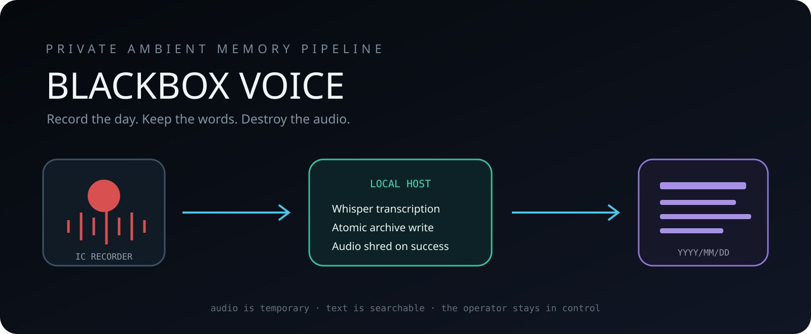
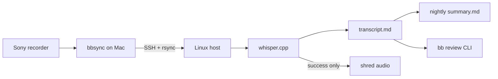
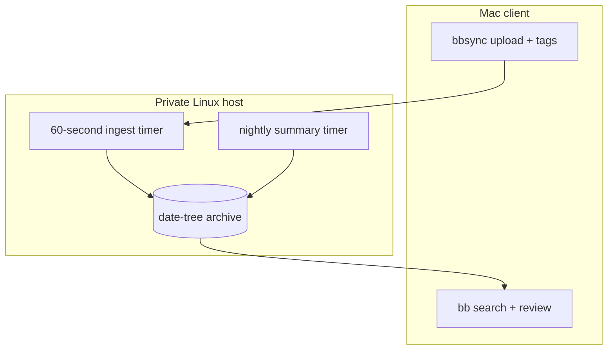
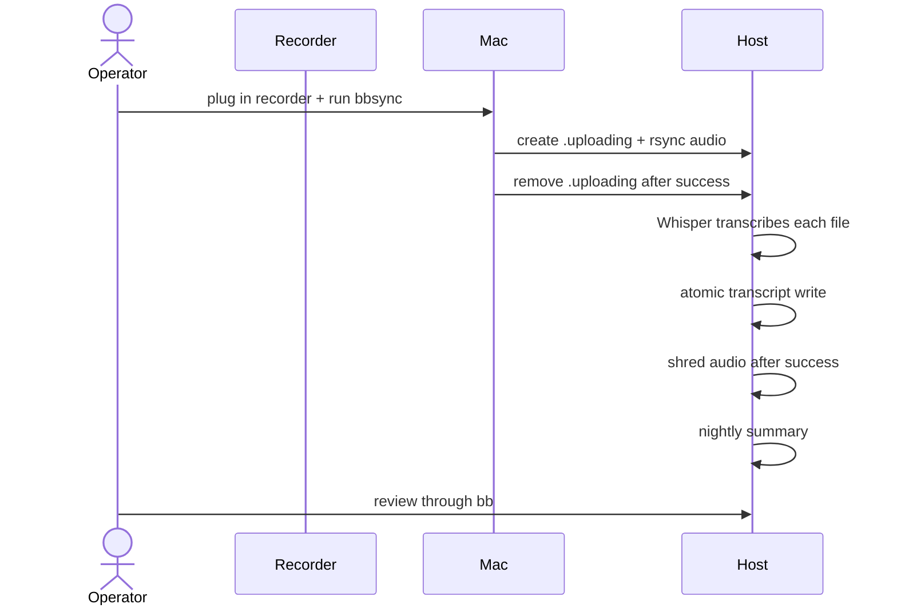
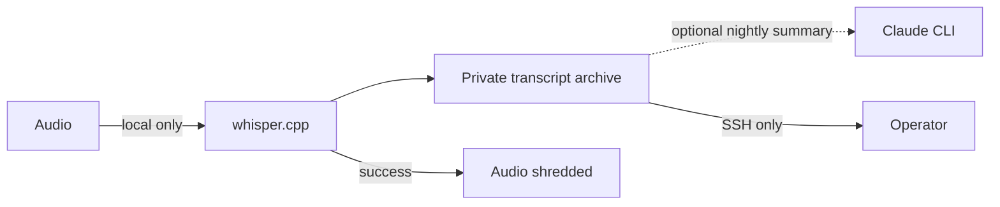

<div align="center">



# blackbox-voice

### Record the day. Keep the words. Destroy the audio.

</div>

A personal ambient-recording pipeline. Plug in a Sony IC Recorder at the end of the day, run one command, and wake up to a transcribed + summarized archive of your day. Everything stays on your own hardware except the daily summary call to Claude.

```
[Sony IC Recorder] → bbsync (Mac) → rsync over SSH → Linux host
                                                       ├─ Whisper transcribe (whisper.cpp)
                                                       ├─ Shred audio
                                                       ├─ Per-recording transcript.md
                                                       └─ Nightly Claude summary → summary.md
                                                       
                                              bb (Mac/Linux CLI) → SSH-wrapped review
```



**Design goals.**
- Audio never persists past transcription (shredded on success).
- Transcripts + daily summary live in a date-tree archive on the host: `/data/blackbox/YYYY/MM/DD/`.
- One systemd timer per stage; no cron, no daemons.
- The pipeline is operator-readable: every step writes to a single `_log` you can `tail -f`.
- No API keys or third-party SaaS dependencies beyond what you already have (the daily summary uses your Claude Code Max subscription via the local CLI; if you don't have that, the rest of the pipeline still works).

## Components



| File | Where it runs | Role |
|---|---|---|
| `bbsync` | Mac client | Detect mounted IC RECORDER → prompt for tags → rsync session to host |
| `bb` | Mac/Linux client | SSH-wrapped review CLI: search, list, show, status |
| `bounce_blackbox.sh` | Linux host | systemd timer-fired every 60s: ingest → Whisper → transcript.md → shred audio |
| `daily-summary.py` | Linux host | systemd timer-fired nightly: Claude Sonnet summarizes the day's transcripts |
| `alert-on-fail.sh` | Linux host | systemd `ExecStopPost` helper: optional ntfy push if a service fails |
| `install-host.sh` | Linux host | One-shot installer: dirs, perms, dependencies, systemd units |
| `install-client.sh` | Mac client | One-shot installer: bin symlinks, optional sshfs auto-mount LaunchAgent |
| `systemd/*.timer`, `*.service` | Linux host | Two timer/service pairs (bounce + daily-summary) |
| `launchagents/com.blackbox.mount.plist` | Mac client | Optional Finder-mounted view of `host:/data/blackbox/` via sshfs |
| `tag-vocab.md` | Reference | Tag conventions for session sidecars |

## Install

### Prerequisites — knock these out first

**Both sides:**
- Git (to clone this repo)
- An SSH keypair, with the client's public key in the host's `~/.ssh/authorized_keys`

**Host side (Linux — needs build tools to compile whisper.cpp):**

```bash
# Build toolchain + runtime deps in one shot (Debian/Ubuntu)
sudo apt update
sudo apt install -y build-essential cmake \
    ffmpeg coreutils rsync openssh-client util-linux curl ripgrep python3

# (Optional, for daily summaries) Node ≥ 20 via nvm, for the Claude CLI
curl -fsSL -o- https://raw.githubusercontent.com/nvm-sh/nvm/v0.40.1/install.sh | bash
source ~/.nvm/nvm.sh && nvm install 22
```

- **Python ≥ 3.10** required (`daily-summary.py` uses `str | None` union syntax). Ubuntu 22.04 ships 3.10, Debian 12 ships 3.11 — fine. Older distros: install Python 3.10+ explicitly.
- **Disk budget:** ~10 MB per hour of recording for transcripts. Audio is shredded post-transcription, so the archive grows slowly.
- **Hardware:** the pipeline works on anything that compiles whisper.cpp — Jetson Orin Nano, Ryzen mini-PC, full server. The hard floor is whatever the Whisper model you choose can run at acceptable speed (see below).

**Client side (macOS):**
- Xcode command-line tools if you don't already have them: `xcode-select --install`
- That's it — `bbsync` and `bb` are pure shell, no other deps. (Optional `fuse-t` + `sshfs` install is documented in `install-client.sh` for Finder-mounted archive browsing.)

### Whisper model sizing

| Model | GGML size | Speed on modern x86 CPU | Speed on Apple Silicon / Orin Nano | Quality |
|---|---|---|---|---|
| `tiny` | ~75 MB | very fast | very fast | low |
| `base` | ~142 MB | fast | fast | usable |
| `small` (default) | ~466 MB | ~2x realtime | ~5–10x realtime | CPU sweet spot |
| `medium` | ~1.5 GB | ~2x slower than small | OK | better proper-noun + accent handling |
| `large-v3` | ~3.1 GB | needs GPU or Apple Silicon | OK on M-series | best |

Switch via `BLACKBOX_WHISPER_MODEL=medium` after running the model's downloader (`bash models/download-ggml-model.sh medium` inside the whisper.cpp dir).

### Host install

```bash
# Build whisper.cpp + grab the small model
git clone https://github.com/ggerganov/whisper.cpp ~/whisper.cpp
cd ~/whisper.cpp && make
bash models/download-ggml-model.sh small

# (Optional, for daily summaries) Claude Code Max subscription via the local CLI
npm install -g @anthropic-ai/claude-code
mkdir -p ~/.local/bin
ln -sf ~/.nvm/versions/node/$(nvm current)/bin/claude ~/.local/bin/claude
claude /login   # interactive — pairs with your Max sub

# Then install blackbox-voice:
git clone https://github.com/DTSthom/blackbox-voice ~/blackbox-voice
cd ~/blackbox-voice && ./install-host.sh
```

`install-host.sh` re-checks the dependency list, creates `/data/blackbox` and `~/blackbox-incoming` with `700` perms, installs the four systemd units (substituting `@USER@` / `@HOME@` / `@SCRIPT_DIR@` placeholders for your install path), and enables both timers.

### Client install (Mac)

```bash
git clone https://github.com/DTSthom/blackbox-voice ~/blackbox-voice
cd ~/blackbox-voice
export BLACKBOX_HOST=your-host-alias   # SSH alias from ~/.ssh/config, or user@host
./install-client.sh
```

`install-client.sh` symlinks `bbsync` + `bb` into `~/bin`, verifies SSH to your host, and optionally installs a fuse-t + sshfs LaunchAgent for a Finder-mounted view of the archive (skipped if sshfs isn't installed — the `bb` CLI works without it).

### SSH wiring

The client SSHes to the host as your operator account. Set up either an alias in `~/.ssh/config`:

```
Host blackbox-host
    HostName 10.0.0.42
    User you
```

…or set `BLACKBOX_HOST=user@host` in your shell env. Whatever target you pick must accept passwordless key-based auth from the client (and have rsync + ssh installed).

## Daily flow



1. Plug the IC RECORDER into the Mac.
2. `bbsync` — auto-detects the recorder, prompts for tags (free-form, see [`tag-vocab.md`](tag-vocab.md)), uploads.
3. Optionally answer "yes" when bbsync asks to wipe the recorder.
4. The host's `bounce-blackbox.timer` (every 60s) picks up the new session, runs Whisper, writes a transcript per file, and shreds the audio.
5. At 01:00 local time, `daily-summary.timer` fires `daily-summary.py` on yesterday's transcripts, producing a one-page Claude summary.
6. Review: `bb today` (or `bb summary today`, `bb search "<pattern>"`, `bb tag person:alice`, `bb status`).

## Configuration (environment variables)

| Variable | Default | Used by | Meaning |
|---|---|---|---|
| `BLACKBOX_HOST` | `blackbox-host` | bbsync, bb, install-client | SSH target for the host |
| `BLACKBOX_BASE` | `/data/blackbox` | bounce, daily-summary | Archive root on the host |
| `BLACKBOX_INCOMING` | `~/blackbox-incoming` | bb status | Pending-uploads dir on the host |
| `BLACKBOX_WHISPER_MODEL` | `small` | bounce | Whisper model size (`tiny`, `base`, `small`, `medium`, `large`) |
| `BLACKBOX_WHISPER_LANG` | `en` | bounce | Whisper language code |
| `BLACKBOX_RECORDER_TZ` | `America/New_York` | bounce | TZ the Sony recorder's clock is set to |
| `BLACKBOX_WEDGE_SEC` | `14400` (4h) | bounce | Wedge-alert threshold for stuck whisper-cli |
| `BLACKBOX_NTFY_TOPIC` | unset (alerts off) | bounce, alert-on-fail | ntfy.sh topic for push alerts on failure or wedge |
| `BLACKBOX_MODEL` | `sonnet` | daily-summary | Claude model name for the daily summary |
| `CLAUDE_BIN` | `~/.local/bin/claude` | daily-summary | Path to Claude CLI |

Put any non-defaults in `/etc/environment` (host) or `~/.zshenv` (Mac client).

## Storage layout

```
/data/blackbox/
├── _log                          # bounce + daily-summary events; trimmed at 7500 lines
├── 2026/
│   └── 05/
│       └── 25/
│           ├── transcript-260525_142345.md    # one per recording
│           ├── transcript-260525_153021.md
│           ├── summary.md                      # one per day (nightly)
│           └── .session-tags-session-...txt    # archived tags sidecar
```

- **Audio:** never persisted — `shred -u` runs as soon as Whisper succeeds. If Whisper errors out, audio is retained at `/data/blackbox/YYYY/MM/DD/audio/<filename>` for operator recovery.
- **Transcripts:** Markdown with YAML frontmatter (`source_file`, `recorder_timestamp`, `ingest_timestamp`, `duration`, `whisper_model`, `tags`, `recorder_tz`). Body is Whisper's segmented output: `[HH:MM:SS.mmm --> HH:MM:SS.mmm]  text` per line. Add the offset to `recorder_timestamp` to compute absolute wall-clock for any line.
- **Summaries:** one `summary.md` per day, generated nightly. Written atomically (write `.tmp` + chmod 0600 + rename → no partial-file readers).
- **Logs:** `_log` records ingest, Whisper start/end, errors, wedge alerts — filenames + timing only, never transcript text. Auto-rotates at 7500 lines.

## bb CLI

```bash
bb search "<pattern>"              # ripgrep over all transcripts
bb today                           # today's transcripts + summary
bb yesterday                       # yesterday's
bb date 2026-05-22                 # specific date
bb tag person:alice                # all transcripts tagged with that tag
bb summary today|yesterday|<date>  # just the summary file
bb log [N]                         # tail the _log (default 30 lines)
bb ls                              # all archived dates
bb ls 2026-05                      # dates in May 2026
bb status                          # pending sessions + in-flight uploads + last log + disk + timers
```

## Privacy + security posture



- `/data/blackbox/` is mode `700`, owned by your operator user. `_log` is `600`. Transcripts + summaries are `600`.
- No encryption at rest. The pipeline assumes "host SSH access = archive access" — protect the SSH key on the client.
- No backup target in v1. Add your own (restic, rsync to remote, B2, NAS) if you want offsite durability.
- The daily summary call sends transcripts to Anthropic via the Claude CLI. Audio never leaves your host (it's shredded on the host post-Whisper). If you don't want Anthropic to see transcripts, disable `daily-summary.timer` and skip the summaries.
- Tags + transcripts are operator-readable plaintext. Treat the archive as you would a personal journal.

## Atomicity + race-handling notes

The uploader and processor coordinate via a `.uploading` flag file:
- `bbsync` writes `.uploading` in the session dir *atomically with* the `mkdir` (single SSH call).
- `bounce_blackbox.sh` skips any session_dir containing `.uploading`.
- `bbsync` removes `.uploading` after rsync completes successfully.

This prevents the processor from observing partial state mid-upload (which would otherwise cause `cleanup_session` to archive tags.txt before all audio landed, breaking `bb tag` for that day).

A defense-in-depth `find -mmin -0.5` (30s) per-file mtime guard catches the edge case of a manually-restored session without a `.uploading` flag.

## Troubleshooting

**Whisper fails on a file:**
- Check `bb log` for the error.
- Audio is RETAINED at `/data/blackbox/YYYY/MM/DD/audio/<filename>` (NOT shredded) for manual recovery.
- Manual rerun: move the file back to `~/blackbox-incoming/session-*/` and let the next timer tick pick it up.

**Daily summary fails:**
- Check `claude --version` and `claude /status` on the host — Max sub login may have expired.
- `systemctl status daily-summary.service` shows last run + exit code.
- Manual rerun: `python3 daily-summary.py YYYY-MM-DD --force`.

**Stuck whisper (wedge):**
- `bb log | grep WEDGE` — bounce logs a `WEDGE:` line when oldest whisper-cli runtime exceeds `BLACKBOX_WEDGE_SEC` (4h default), rate-limited to one alert per hour.
- If `BLACKBOX_NTFY_TOPIC` is set, you'll also get a push notification.

**bb commands hang:**
- Your `BLACKBOX_HOST` SSH target is unreachable. Check VPN / Tailscale / network path.
- Direct check: `ssh "$BLACKBOX_HOST" true`.

**No audio detected by bbsync:**
- Confirm `/Volumes/IC RECORDER` is mounted (it auto-mounts when plugged in).
- Sony stores files under `REC_FILE/FOLDERnn` or `VOICE/FOLDERnn` depending on settings.
- Override: `bbsync --source /path/to/files`.

**`tags.txt` for a session ended up empty:**
- Check `bb status` for a wedged `.uploading` flag (bbsync crashed mid-upload). Clear manually: `ssh "$BLACKBOX_HOST" "rm -f ~/blackbox-incoming/session-*/.uploading"`.

## License

MIT. See [LICENSE](LICENSE).

## Acknowledgments

- [whisper.cpp](https://github.com/ggerganov/whisper.cpp) for fast local transcription.
- [fuse-t](https://github.com/macos-fuse-t/fuse-t) + [sshfs](https://github.com/macos-fuse-t/sshfs) for the userspace macOS sshfs (no kernel extension).
- [ntfy.sh](https://ntfy.sh) for the optional push-alert path.
- Claude Code (Anthropic) for the nightly summaries.
